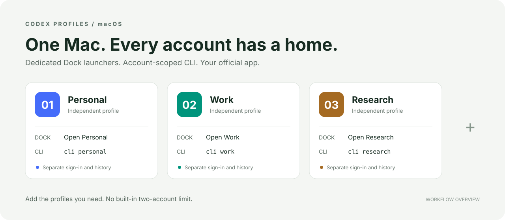

<div align="center">

# Codex Profiles

**One Mac. Independent Codex accounts. Desktop and CLI.**

[](#requirements)
[](#requirements)
[](LICENSE)
[](https://github.com/original4422/codex-profiles/actions/workflows/check.yml)

[简体中文](README.zh-CN.md) · [Quick start](#quick-start) · [Agent install](#let-your-agent-install-it) · [Commands](docs/USAGE.md) · [Contributing](CONTRIBUTING.md)

</div>



Run your personal, work, research, or client accounts side by side. Each profile gets its own sign-in state, conversation history, and a persistent, numbered Dock launcher. Use the same profile in the official desktop app or Codex CLI.

**Development preview · macOS only · Source installation.** Desktop isolation relies on internal app settings; see [tested behavior and limitations](docs/TESTING.md). This is an independent project, not an OpenAI product.

## Why this exists

Opening a second app process is only half the job. Pinning its *official* app icon to the Dock loses the account-specific launch arguments: quitting and reopening can return you to your default account.

Codex Profiles gives each account a separate launcher identity. Click its numbered icon to open or focus that account—even after quitting the official app.

- **As many profiles as you need.** Named accounts, no hardcoded A/B pair or built-in count limit.
- **Desktop and CLI, one profile.** Choose the account at launch time.
- **Persistent Dock entry.** A dedicated name and numbered icon for each account.
- **Local and direct.** No proxy, copied tokens, modified official app, or Python runtime dependencies.
- **Inspectable installation.** Dry-run planning, separate state paths, installation backups and rollback.

## Quick start

Clone the repository, then preview and install a profile:

```bash
git clone https://github.com/original4422/codex-profiles.git
cd codex-profiles

# Preview the installation without changing files or the Dock.
python3 install.py --profile work --name "Work" --dry-run

# Install a dedicated Work launcher and pin it to the Dock.
python3 install.py --profile work --name "Work" --pin
```

Open `~/Applications/Codex work.app` and sign in to the intended ChatGPT account. The installer does not sign you in automatically.

Add more accounts with the installed command:

```bash
~/.local/bin/codex-profile add research --name "Research" --pin
~/.local/bin/codex-profile add client --name "Client" --pin

~/.local/bin/codex-profile desktop work
~/.local/bin/codex-profile cli research
~/.local/bin/codex-profile cli client -C /path/to/project
```

`add` builds the launcher in the same step. Repeat it for additional accounts; the practical limit is your Mac's resources and each account's service limits.

Your ordinary `codex` command keeps its current account. For example, use your new Work desktop launcher alongside your existing personal CLI. If `~/.local/bin` is already on `PATH`, you can shorten the commands to `codex-profile …`.

## Let your agent install it

### 一句话让你的 agent 帮你安装

Paste this into your coding agent:

> 请帮我安装 https://github.com/original4422/codex-profiles ，按照仓库的 docs/AGENT_INSTALL.md 检查环境和已有账号配置，再按我需要的账号数量创建独立的桌面与 CLI 入口，固定到 Dock，保留已有登录信息，最后验证安装并告诉我如何使用。

Or in English:

> Install https://github.com/original4422/codex-profiles using its docs/AGENT_INSTALL.md: check my environment and existing profiles, create the independent desktop and CLI entries I need, pin the launchers to the Dock, preserve existing sign-ins, and verify the installation.

See the [agent installation guide](docs/AGENT_INSTALL.md) for the exact steps. Installation builds the launchers locally from source.

## Requirements

| Requirement | Purpose |
| --- | --- |
| macOS | Native Dock launchers and app activation |
| Official ChatGPT/Codex desktop app | Runs the actual desktop sessions and provides a bundled CLI fallback |
| Python 3.10+ | Installer and account manager; standard library only |
| Xcode Command Line Tools | Swift compiler and native build tools |

The source is compiled on your Mac and ad-hoc signed locally. No administrator access is needed for this tool's default installation. Linux and Windows desktop launchers are not implemented.

## Everyday commands

| Command | Action |
| --- | --- |
| `codex-profile list` | List configured accounts and paths |
| `codex-profile add <id> --pin` | Create another account and its Dock launcher |
| `codex-profile desktop <id>` | Open or focus that account's desktop app |
| `codex-profile cli <id> [args…]` | Run Codex CLI with that account |
| `codex-profile terminal <id>` | Open its CLI in Terminal |
| `codex-profile status <id>` | Ask the official CLI for authentication status |
| `codex-profile doctor <id>` | Check paths, launcher and Dock registration |
| `codex-profile pin <id>` | Pin an installed launcher |

**Quit and reopen:** Cmd+Q in the official app exits that account's desktop process. Its numbered launcher remains in the Dock. Click the numbered icon to return to the same account. The official app may still show its own running icon; pin and use the *numbered launcher*.

## How it works

```text
Named profile
├── CODEX_HOME ───────────────────────────────→ Codex CLI
└── CODEX_HOME + independent desktop data ────→ Official desktop app
         ↑
Persistent, account-specific Dock launcher
```

New accounts live under `~/Library/Application Support/Codex Profiles/accounts/<id>` and `desktop/<id>`. The launcher passes `CODEX_HOME`, `CODEX_ELECTRON_USER_DATA_PATH`, and `--user-data-dir`. Existing processes are matched by the profile data files they actually have open, not by their shared application name.

These are application profiles, not operating-system sandboxes. Accounts can access the same local projects; use separate worktrees when editing concurrently. Sharing a profile between desktop and CLI also shares its authentication state.

[Full usage and existing accounts](docs/USAGE.md) · [Architecture](docs/ARCHITECTURE.md) · [Testing](docs/TESTING.md)

## Development

```bash
python3 -m venv .venv
source .venv/bin/activate
python -m pip install -r requirements-dev.txt
make check

# macOS: compile four launchers in a temporary directory and verify CLI routing.
make smoke
```

Ruff checks Python formatting and lint; native sources use `swift-format`. The test suite covers multi-profile isolation, command arguments, installation planning and failure rollback. Smoke tests use a local fixture, never real credentials or model calls.

See [CONTRIBUTING.md](CONTRIBUTING.md). Keep changes small; propose compatibility layers before implementing them.

## Credits & license

Inspired by the account-directory isolation approach in [chatgpt-multi-account](https://github.com/ccheney/chatgpt-multi-account) and [codex-account-switcher](https://github.com/edihasaj/codex-account-switcher). The launcher and manager here are independently implemented.

[MIT](LICENSE). Authentication and subscription access remain with the [official Codex client](https://learn.chatgpt.com/docs/auth).
