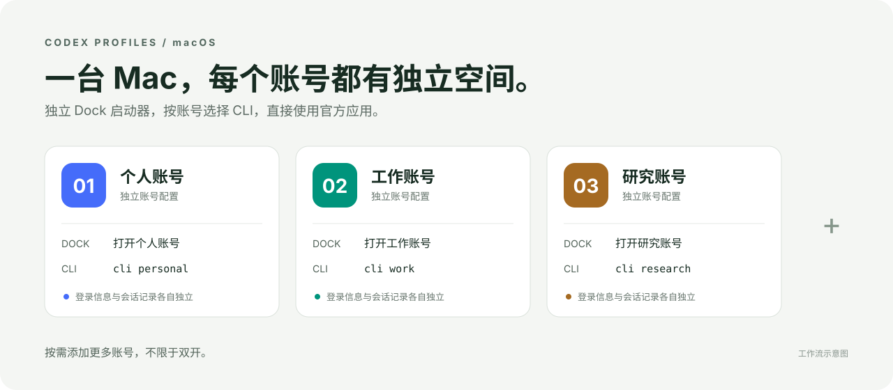

<div align="center">

# Codex Profiles

**一台 Mac，多个独立账号，桌面和 CLI 自由搭配。**

[English](README.en.md) · [让 agent 安装](#一句话让你的-agent-帮你安装) · [快速开始](#快速开始) · [使用手册](docs/USAGE.md)

</div>



让个人、工作、研究或客户账号同时使用官方 Codex。每个账号有独立的登录信息、会话目录和带编号的 Dock 启动器；桌面与 CLI 可以使用相同账号，也可以选择不同账号。

**支持 macOS，采用源码安装。**

## 为什么需要它

打开第二个官方应用进程后，将它的官方图标固定到 Dock，并不能保存第二账号的启动参数。退出再点击时，可能又回到默认账号。

本项目为每个账号创建独立的常驻启动器。固定并点击带编号的图标，才能始终打开或聚焦对应账号。

- **不限于双开**：账号 ID、名称和数量由你决定，没有内置数量上限。
- **一套配置，两种入口**：桌面与 CLI 均可指定账号。
- **独立 Dock 入口**：每个账号有自己的应用标识、名称和编号图标。
- **直接使用官方客户端**：不修改官方应用，不复制 token，不增加请求代理。
- **可检查、可恢复**：支持安装预览、安装备份、失败回滚和状态诊断。

## 一句话让你的 agent 帮你安装

向你的编程 agent 复制下面这句话：

> 请帮我安装 https://github.com/original4422/codex-profiles ，按照仓库的 docs/AGENT_INSTALL.md 检查环境和已有账号配置，再按我需要的账号数量创建独立的桌面与 CLI 入口，固定到 Dock，保留已有登录信息，最后验证安装并告诉我如何使用。

具体步骤见 [agent 安装指南](docs/AGENT_INSTALL.md)。安装过程会从源码在本机编译启动器。

## 快速开始

克隆仓库，然后预览并安装：

```bash
git clone https://github.com/original4422/codex-profiles.git
cd codex-profiles

# 只查看计划，不修改文件或 Dock。
python3 install.py --profile work --name "工作账号" --dry-run

# 安装并固定到 Dock。
python3 install.py --profile work --name "工作账号" --pin
```

打开 `~/Applications/Codex work.app`，通过 ChatGPT 登录所需账号。

继续添加更多账号：

```bash
~/.local/bin/codex-profile add research --name "研究账号" --dry-run
~/.local/bin/codex-profile add research --name "研究账号" --pin
~/.local/bin/codex-profile add client --name "客户账号" --pin

~/.local/bin/codex-profile desktop work
~/.local/bin/codex-profile cli research
~/.local/bin/codex-profile cli client -C /path/to/project
```

`add` 会直接构建对应启动器，无需再执行第二条安装命令。重复执行即可添加更多账号。普通 `codex` 命令保持原来的账号；如果 `~/.local/bin` 已在 PATH 中，可以直接使用 `codex-profile`。

## 环境要求

- macOS。
- 官方 ChatGPT/Codex 桌面应用。
- Python 3.10+：运行时只使用标准库。
- Xcode Command Line Tools：在本机编译 Swift 启动器。

本工具默认安装到用户目录，无需管理员权限；图标和原生程序均在本机生成并进行 ad-hoc 签名。

## 常用操作

| 命令 | 功能 |
| --- | --- |
| `codex-profile list` | 查看全部账号及目录 |
| `codex-profile add <id> --pin` | 添加账号并构建 Dock 启动器 |
| `codex-profile desktop <id>` | 打开或聚焦指定账号 |
| `codex-profile cli <id> [参数]` | 使用该账号运行 CLI |
| `codex-profile terminal <id>` | 在 Terminal 中打开该账号 CLI |
| `codex-profile status <id>` | 通过官方 CLI 查询登录状态 |
| `codex-profile doctor <id>` | 检查路径、启动器和 Dock 注册 |

在官方应用窗口按 **Cmd+Q** 后，编号启动器仍然留在 Dock。再次点击编号图标，会按原账号配置打开。原版应用运行时也可能显示自己的图标，请固定并使用编号启动器。

## 更多文档

- [已有账号、参数说明、升级与卸载](docs/USAGE.md)
- [实现原理与边界](docs/ARCHITECTURE.md)
- [测试范围与人工验收](docs/TESTING.md)
- [贡献指南与代码检查](CONTRIBUTING.md)

多个账号可以访问同一用户的本地项目。同一账号配置中的桌面与 CLI 共用认证状态。

## 开发

```bash
python3 -m venv .venv
source .venv/bin/activate
python -m pip install -r requirements-dev.txt
make check
make smoke
```

Python 使用 Ruff，Swift 使用 `swift-format`。集成测试在临时目录构建四个启动器，不读取真实凭据或调用模型。

采用 [MIT 许可证](LICENSE)。参考项目与致谢见 [英文首页](README.en.md#credits--license)。
